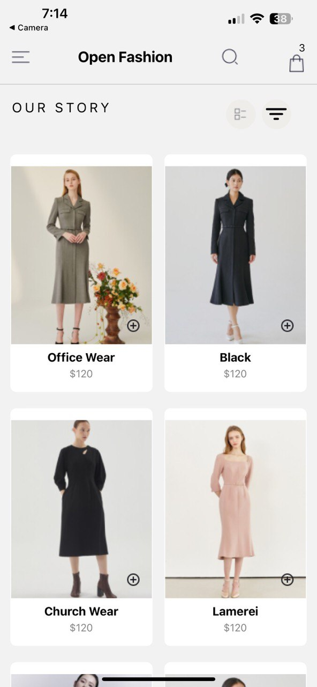
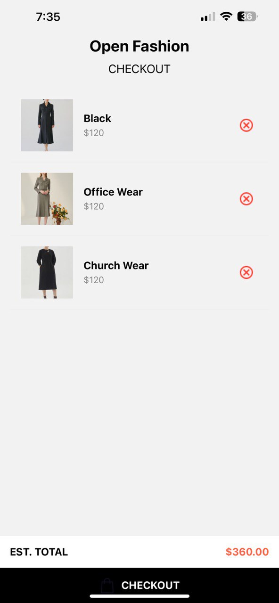

# rn-assignment6-11117229

# Open Fashion - React Native E-commerce App

## Overview

Open Fashion is a React Native e-commerce application for a clothing store. It allows users to browse products, add items to their cart, and manage their shopping cart.

## Features

- Browse a list of clothing products
- Add products to the shopping cart
- View and manage the shopping cart
- Persistent cart storage using AsyncStorage

## Project Structure

The project consists of several key components:

- App.js: The main entry point of the application
- HomeScreen.js: Displays the product list and header
- ProductItem.js: Renders individual product items
- CartScreen.js: Manages the shopping cart
- CartItem.js: Renders individual items in the cart
- StackNavigator.js: Handles navigation between screens

## Usage

1. Ensure you have React Native and Expo CLI installed on your system.
2. Clone the repository to your local machine.
3. Run npm install or yarn install to install dependencies.
4. Start the app using expo start or npm start.

## Dependencies

- React Native
- @react-navigation/native
- @react-native-async-storage/async-storage
- @expo/vector-icons

## Screens

### Home Screen

- Displays a header with menu, search, and cart icons
- Shows a list of products in a grid layout
- Allows users to add products to the cart

### Cart Screen

- Shows items added to the cart
- Allows users to remove items from the cart

## Styling

The app uses a combination of inline styles and StyleSheet objects for consistent styling across components.

## Data Management

- Product data is currently hardcoded in the PRODUCTS array in HomeScreen.js
- Cart data is stored and retrieved using AsyncStorage for persistence

## Future Improvements

- Implement user authentication
- Add a checkout process
- Integrate with a backend API for dynamic product data
- Implement search functionality
- Add product detail pages

## Screenshot

